# Diagrama de Clases - BioServer

## Clases Actuales (VB6)

```mermaid
classDiagram
    class clsBioServer {
        -civ As clsIsolatedVariables
        +SendToServer(id, secret, payload) String
        +ServerFind(id, secret, payload) String
        +FindFinger(id, secret, payload) String
        +FindPalm(id, secret, payload) String
        +FindIris(id, secret, payload) String
        +FindFace(id, secret, payload) String
        +FindVoice(id, secret, payload) String
        +ServerSave(id, secret, payload) String
        +ServerFlush(id, secret, payload) String
        +GetBioKey(id, secret, payload) String
        +GetAppKey(id, secret, payload) String
        +GetDataBioKey(id, secret, payload) String
        +GetDataMapBioKey(id, secret, payload) String
        +GetDataServer(id, secret, payload) String
        +GetDataMapServer(id, secret, payload) String
        +ServerDelete(id, secret, payload) String
        +ServerFuse(id, secret, payload) String
        +Special(id, secret, payload) String
        +ServerCompare(id, secret, payload) String
    }

    class clsIsolatedVariables {
        -db As Connection
        -dbIsOpen As Boolean
        -tm As Double
        +BIOSERVER_BIN_PATH As String
        +BIOSERVER_SUBJECTS_PATH As String
        +BIOSERVER_TMP_TRANS_PATH As String
        +CON_STRING As String
        +ABIS_HOST As String
        +DEBUG_FLAG As String
        +VerifyLicense(ansErr, errKey) Boolean
        +VerifySecret(ClientId, SecretHash, payload, IsDummy, ansErr, errKey) Boolean
        +AnswerError(ErrNum, ErrMsg, ErrDet) Object
        +EasyQuery(rs, q, ansErr, errKey) Boolean
        +EasyDms(q, ansErr, errKey) Boolean
        +EasyCloseDB() Void
        +EasyParse(jsonSrc, varOut, ansErr, errKey, Context) Boolean
        +EasyVal(srcObj, nameOrIndex, varOut, ansErr, errKey, Context, mandatory) Boolean
        +EasyObj(srcObj, nameOrIndex, varOut, ansErr, errKey, Context, mandatory) Boolean
        +EasyCol(srcObj, nameOrIndex, varOut, ansErr, errKey, Context, mandatory) Boolean
        +EasyChildCopy(srcStrong, srcWeak, nameOrIndex, ansErr, errKey, contextStrong, contextWeak) Boolean
        +EasyCombine(srcStrong, srcWeak, ansErr, errKey) Boolean
        +EasyClean(objSrc, ansErr, errKey) Boolean
        +EasyValTTN(srcObj, varOut, IsDummy, ansErr, errKey, ToRead) Boolean
        +EasyReadTT(ttn, varOutTT, varOutPkg, ansErr, errKey) Boolean
        +EasyReadMaster(bk, varOutTT, varOutPkg, ansErr, errKey) Boolean
        +EasyCheckForCol(srcObj, ansErr, errKey, Context) Boolean
        +EasyValidatePkg(reqObj, outPkg, ansErr, errKey) Boolean
        +EasyEnroll(ttObj, ttPkg, ttn, BioKey, AppName, AppKey, ansErr, errKey, FirstTime) Boolean
        +EasyAsync(req, func, ttn, ClientId, ansErr, errKey) Boolean
        +StorePathTT() String
        +StorePath(Subject) String
        +HBIE_VerifyFP(...) Object
        +HBIE_IdentifyFP(...) Object
        +HBIE_EnrollFP(...) Object
        +HBIE_DeleteFP(...) Object
        +HBIE_CompareFP(...) Object
        +HBIE_VerifyIris(...) Object
        +HBIE_IdentifyIris(...) Object
        +HBIE_EnrollIris(...) Object
        +HBIE_DeleteIris(...) Object
        +HBIE_CompareIris(...) Object
        +HBIE_VerifyFace(...) Object
        +HBIE_IdentifyFace(...) Object
        +HBIE_EnrollFace(...) Object
        +HBIE_DeleteFace(...) Object
        +HBIE_CompareFace(...) Object
        +HBIE_VerifyVoice(...) Object
        +HBIE_IdentifyVoice(...) Object
        +HBIE_EnrollVoice(...) Object
        +HBIE_DeleteVoice(...) Object
        +HBIE_VerifyPalm(...) Object
        +HBIE_IdentifyPalm(...) Object
        +HBIE_EnrollPalm(...) Object
        +HBIE_DeletePalm(...) Object
        +HBIE_ComparePalm(...) Object
        +CivWriteFile(pth, s) Boolean
        +CivReadFile(pth) String
        +BIOSERVER_CFG_PUB_K() String
        +BIOSERVER_CFG_PRIV_K() String
        +BIOCLIENT_CLIENT_ID() String
        +GenerateClientID() String
        +GenerateClientSecret(ClientId) String
        +ClientSecretFromDB(ClientId, ClientSecretEncoded) String
    }

    clsBioServer --> clsIsolatedVariables : "1"
```    


## Clases Propuestas (C#)

```mermaid
classDiagram
    class IBiometricServer {
        <<interface>>
        +Task~string~ SendToServerAsync(id, secret, payload)
        +Task~string~ ServerFindAsync(id, secret, payload)
        +Task~string~ FindFingerAsync(id, secret, payload)
        +Task~string~ FindPalmAsync(id, secret, payload)
        +Task~string~ FindIrisAsync(id, secret, payload)
        +Task~string~ FindFaceAsync(id, secret, payload)
        +Task~string~ FindVoiceAsync(id, secret, payload)
        +Task~string~ ServerSaveAsync(id, secret, payload)
        +Task~string~ ServerFlushAsync(id, secret, payload)
        +Task~string~ GetBioKeyAsync(id, secret, payload)
        +Task~string~ GetAppKeyAsync(id, secret, payload)
        +Task~string~ GetDataBioKeyAsync(id, secret, payload)
        +Task~string~ GetDataMapBioKeyAsync(id, secret, payload)
        +Task~string~ GetDataServerAsync(id, secret, payload)
        +Task~string~ GetDataMapServerAsync(id, secret, payload)
        +Task~string~ ServerDeleteAsync(id, secret, payload)
        +Task~string~ ServerFuseAsync(id, secret, payload)
        +Task~string~ SpecialAsync(id, secret, payload)
        +Task~string~ ServerCompareAsync(id, secret, payload)
    }

    class BioServerService {
        -BioServerPool _pool
        -ILogger _logger
        -BioServerConfig _config
        +Task~string~ SendToServerAsync(id, secret, payload)
        +Task~string~ ServerFindAsync(id, secret, payload)
        +Task~string~ FindFingerAsync(id, secret, payload)
        +Task~string~ FindPalmAsync(id, secret, payload)
        +Task~string~ FindIrisAsync(id, secret, payload)
        +Task~string~ FindFaceAsync(id, secret, payload)
        +Task~string~ FindVoiceAsync(id, secret, payload)
        +Task~string~ ServerSaveAsync(id, secret, payload)
        +Task~string~ ServerFlushAsync(id, secret, payload)
        +Task~string~ GetBioKeyAsync(id, secret, payload)
        +Task~string~ GetAppKeyAsync(id, secret, payload)
        +Task~string~ GetDataBioKeyAsync(id, secret, payload)
        +Task~string~ GetDataMapBioKeyAsync(id, secret, payload)
        +Task~string~ GetDataServerAsync(id, secret, payload)
        +Task~string~ GetDataMapServerAsync(id, secret, payload)
        +Task~string~ ServerDeleteAsync(id, secret, payload)
        +Task~string~ ServerFuseAsync(id, secret, payload)
        +Task~string~ SpecialAsync(id, secret, payload)
        +Task~string~ ServerCompareAsync(id, secret, payload)
        +Dispose() Void
    }

    class BioServerPool {
        -ConcurrentBag~BioServerWrapper~ _instances
        -SemaphoreSlim _semaphore
        -int _maxInstances
        -int _currentCount
        -ILogger _logger
        +InitializeAsync() Task
        +GetInstanceAsync(cancellationToken) Task~BioServerWrapper~
        +ReturnInstance(instance) Void
        +Dispose() Void
    }

    class BioServerWrapper {
        -const string DllName
        -bool _disposed
        +SendToServer(id, secret, payload) string
        +ServerFind(id, secret, payload) string
        +FindFinger(id, secret, payload) string
        +FindPalm(id, secret, payload) string
        +FindIris(id, secret, payload) string
        +FindFace(id, secret, payload) string
        +FindVoice(id, secret, payload) string
        +ServerSave(id, secret, payload) string
        +ServerFlush(id, secret, payload) string
        +GetBioKey(id, secret, payload) string
        +GetAppKey(id, secret, payload) string
        +GetDataBioKey(id, secret, payload) string
        +GetDataMapBioKey(id, secret, payload) string
        +GetDataServer(id, secret, payload) string
        +GetDataMapServer(id, secret, payload) string
        +ServerDelete(id, secret, payload) string
        +ServerFuse(id, secret, payload) string
        +Special(id, secret, payload) string
        +ServerCompare(id, secret, payload) string
        +Dispose() Void
    }

    class BioServerConfig {
        +int MaxInstances
        +int TimeoutSeconds
        +string DllPath
        +bool EnableDebug
    }

    class BioServerController {
        -BioServerService _service
        -ILogger _logger
        +SendToServer(request) IActionResult
        +ServerFind(request) IActionResult
        +FindFinger(request) IActionResult
        +FindPalm(request) IActionResult
        +FindIris(request) IActionResult
        +FindFace(request) IActionResult
        +FindVoice(request) IActionResult
        +ServerSave(request) IActionResult
        +ServerFlush(request) IActionResult
        +GetBioKey(request) IActionResult
        +GetAppKey(request) IActionResult
        +GetDataBioKey(request) IActionResult
        +GetDataMapBioKey(request) IActionResult
        +GetDataServer(request) IActionResult
        +GetDataMapServer(request) IActionResult
        +ServerDelete(request) IActionResult
        +ServerFuse(request) IActionResult
        +Special(request) IActionResult
        +ServerCompare(request) IActionResult
    }

    BioServerService --> BioServerPool : "usa"
    BioServerService --> BioServerConfig : "lee"
    BioServerPool --> BioServerWrapper : "gestiona"
    BioServerController --> BioServerService : "llama"
    IBiometricServer <|.. BioServerService : "implementa"
    ```