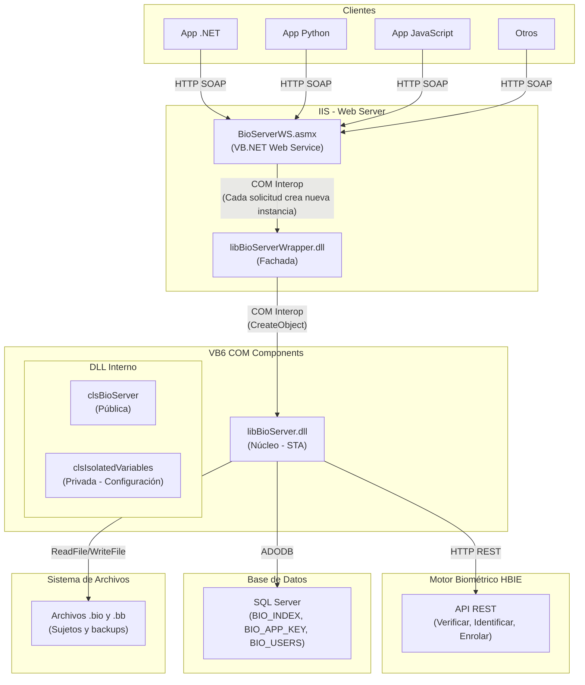
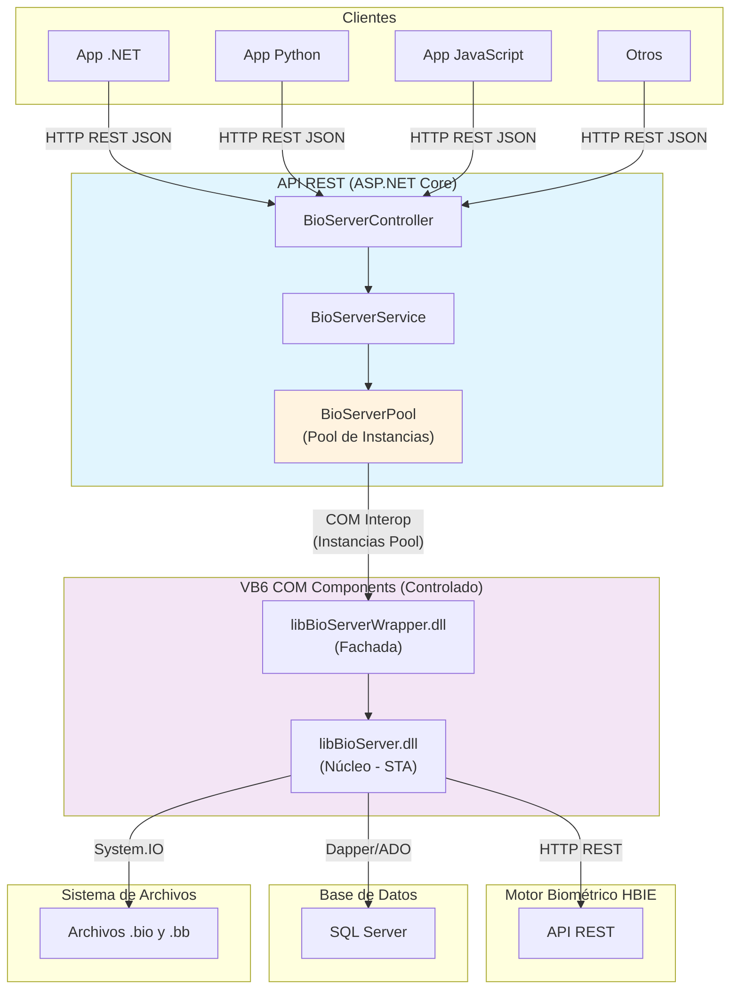

# Diagrama de Componentes - BioServer

## Arquitectura Actual

```mermaid
graph TB
    subgraph Clientes["Clientes"]
        C1["App .NET"]
        C2["App Python"]
        C3["App JavaScript"]
        C4["Otros"]
    end

    subgraph IIS["IIS - Web Server"]
        WS["BioServerWS.asmx<br/>(VB.NET Web Service)"]
        WS --> |"COM Interop<br/>(Cada solicitud crea nueva instancia)"| Wrapper
    end

    subgraph VB6["VB6 COM Components"]
        Wrapper["libBioServerWrapper.dll<br/>(Fachada)"]
        Wrapper --> |"COM Interop<br/>(CreateObject)"| DLL
        DLL["libBioServer.dll<br/>(Núcleo - STA)"]
        
        subgraph DLL_Interno["DLL Interno"]
            ClsBioServer["clsBioServer<br/>(Pública)"]
            ClsIsolated["clsIsolatedVariables<br/>(Privada - Configuración)"]
        end
    end

    subgraph HBIE["Motor Biométrico HBIE"]
        HBIE_API["API REST<br/>(Verificar, Identificar, Enrolar)"]
    end

    subgraph DB["Base de Datos"]
        SQL["SQL Server<br/>(BIO_INDEX, BIO_APP_KEY, BIO_USERS)"]
    end

    subgraph FS["Sistema de Archivos"]
        Archivos["Archivos .bio y .bb<br/>(Sujetos y backups)"]
    end

    C1 --> |"HTTP SOAP"| WS
    C2 --> |"HTTP SOAP"| WS
    C3 --> |"HTTP SOAP"| WS
    C4 --> |"HTTP SOAP"| WS

    DLL --> |"HTTP REST"| HBIE_API
    DLL --> |"ADODB"| SQL
    DLL --> |"ReadFile/WriteFile"| Archivos
```

## Arquitectura Propuesta

```mermaid
graph TB
    subgraph Clientes["Clientes"]
        C1["App .NET"]
        C2["App Python"]
        C3["App JavaScript"]
        C4["Otros"]
    end

    subgraph API["API REST (ASP.NET Core)"]
        Controller["BioServerController"]
        Service["BioServerService"]
        Pool["BioServerPool<br/>(Pool de Instancias)"]
        
        Controller --> Service
        Service --> Pool
    end

    subgraph VB6["VB6 COM Components (Controlado)"]
        Wrapper["libBioServerWrapper.dll<br/>(Fachada)"]
        Wrapper --> DLL
        DLL["libBioServer.dll<br/>(Núcleo - STA)"]
    end

    subgraph HBIE["Motor Biométrico HBIE"]
        HBIE_API["API REST"]
    end

    subgraph DB["Base de Datos"]
        SQL["SQL Server"]
    end

    subgraph FS["Sistema de Archivos"]
        Archivos["Archivos .bio y .bb"]
    end

    C1 --> |"HTTP REST JSON"| Controller
    C2 --> |"HTTP REST JSON"| Controller
    C3 --> |"HTTP REST JSON"| Controller
    C4 --> |"HTTP REST JSON"| Controller

    Pool --> |"COM Interop<br/>(Instancias Pool)"| Wrapper
    DLL --> |"HTTP REST"| HBIE_API
    DLL --> |"Dapper/ADO"| SQL
    DLL --> |"System.IO"| Archivos

    style API fill:#e1f5fe
    style Pool fill:#fff3e0
    style VB6 fill:#f3e5f5
```
