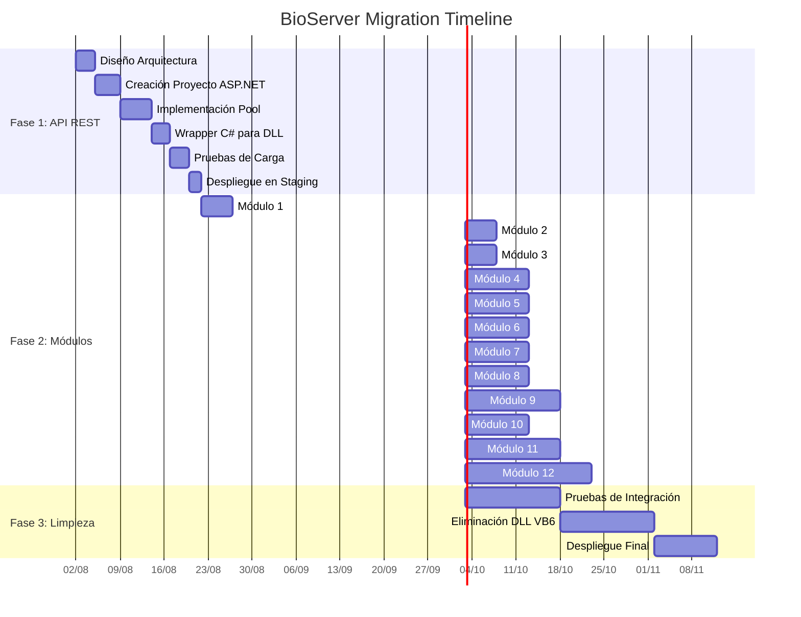
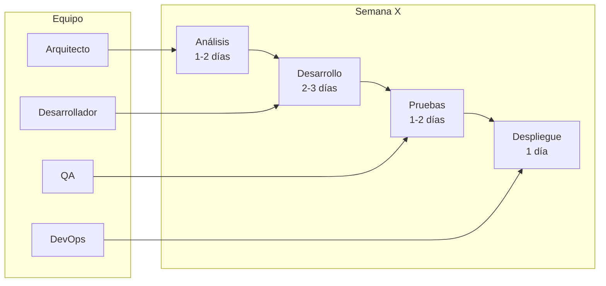
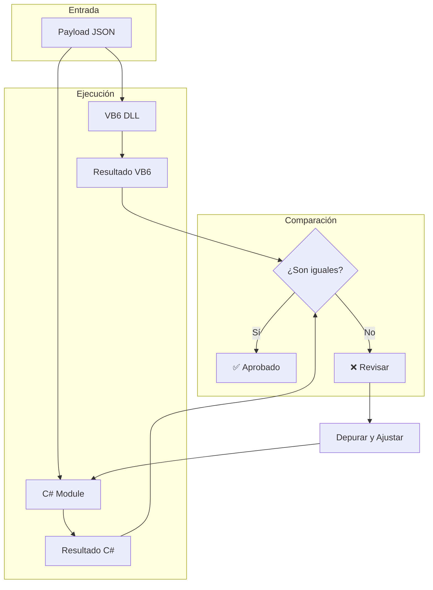
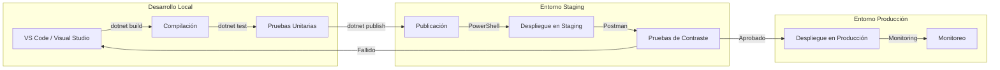

# Diagrama de Flujo de Carriles - Migración BioServer

## Flujo de Migración por Fases

## Flujo de Carriles - Por Módulo

## Flujo de Carriles - Pruebas de Contraste

## Flujo de Carriles - Despliegue
