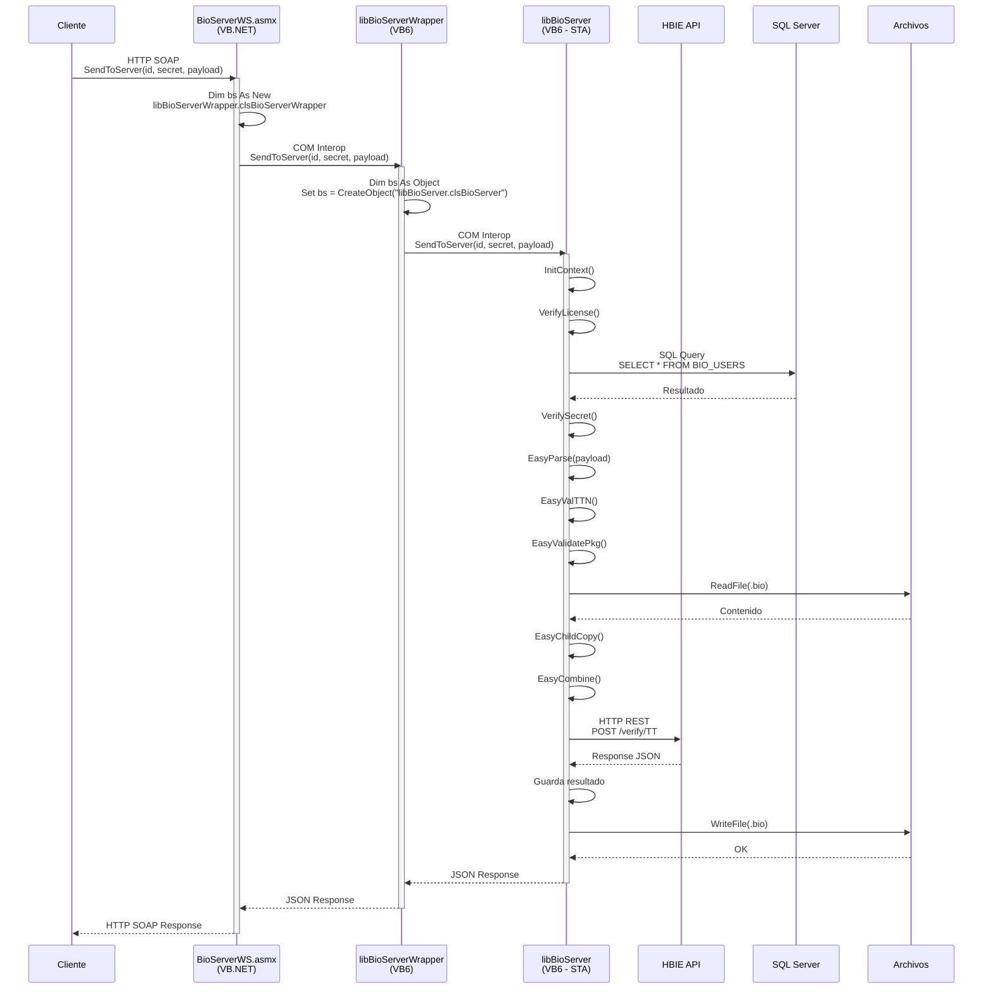
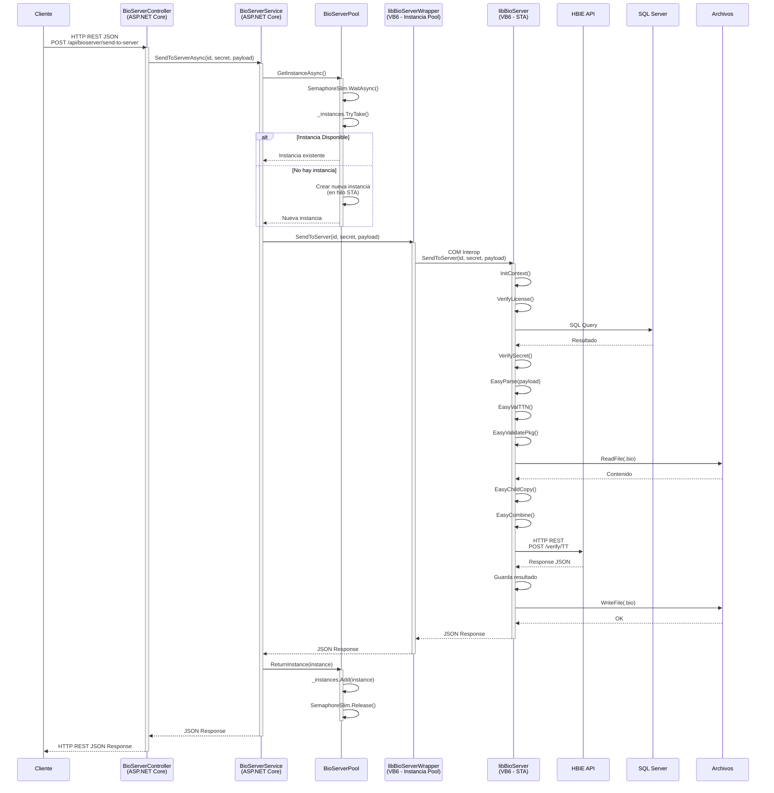

# Diagrama de Secuencia - BioServer

## Flujo Actual (SOAP + VB6)

```mermaid
sequenceDiagram
    participant C as Cliente
    participant WS as BioServerWS.asmx<br/>(VB.NET)
    participant W as libBioServerWrapper<br/>(VB6)
    participant D as libBioServer<br/>(VB6 - STA)
    participant H as HBIE API
    participant DB as SQL Server
    participant FS as Archivos

    C->>WS: HTTP SOAP<br/>SendToServer(id, secret, payload)
    activate WS
    
    WS->>WS: Dim bs As New<br/>libBioServerWrapper.clsBioServerWrapper
    WS->>W: COM Interop<br/>SendToServer(id, secret, payload)
    activate W
    
    W->>W: Dim bs As Object<br/>Set bs = CreateObject("libBioServer.clsBioServer")
    W->>D: COM Interop<br/>SendToServer(id, secret, payload)
    activate D
    
    D->>D: InitContext()
    D->>D: VerifyLicense()
    D->>DB: SQL Query<br/>SELECT * FROM BIO_USERS
    DB-->>D: Resultado
    
    D->>D: VerifySecret()
    D->>D: EasyParse(payload)
    
    D->>D: EasyValTTN()
    D->>D: EasyValidatePkg()
    
    D->>FS: ReadFile(.bio)
    FS-->>D: Contenido
    
    D->>D: EasyChildCopy()
    D->>D: EasyCombine()
    
    D->>H: HTTP REST<br/>POST /verify/TT
    H-->>D: Response JSON
    
    D->>D: Guarda resultado
    
    D->>FS: WriteFile(.bio)
    FS-->>D: OK
    
    D-->>W: JSON Response
    deactivate D
    
    W-->>WS: JSON Response
    deactivate W
    
    WS-->>C: HTTP SOAP Response
    deactivate WS
```
## Flujo Propuesto (REST + Pool)

```mermaid
sequenceDiagram
    participant C as Cliente
    participant CTR as BioServerController<br/>(ASP.NET Core)
    participant SVC as BioServerService<br/>(ASP.NET Core)
    participant P as BioServerPool
    participant W as libBioServerWrapper<br/>(VB6 - Instancia Pool)
    participant D as libBioServer<br/>(VB6 - STA)
    participant H as HBIE API
    participant DB as SQL Server
    participant FS as Archivos

    C->>CTR: HTTP REST JSON<br/>POST /api/bioserver/send-to-server
    activate CTR
    
    CTR->>SVC: SendToServerAsync(id, secret, payload)
    activate SVC
    
    SVC->>P: GetInstanceAsync()
    activate P
    
    P->>P: SemaphoreSlim.WaitAsync()
    P->>P: _instances.TryTake()
    
    alt Instancia Disponible
        P-->>SVC: Instancia existente
    else No hay instancia
        P->>P: Crear nueva instancia<br/>(en hilo STA)
        P-->>SVC: Nueva instancia
    end
    
    deactivate P
    
    SVC->>W: SendToServer(id, secret, payload)
    activate W
    
    W->>D: COM Interop<br/>SendToServer(id, secret, payload)
    activate D
    
    D->>D: InitContext()
    D->>D: VerifyLicense()
    D->>DB: SQL Query
    DB-->>D: Resultado
    
    D->>D: VerifySecret()
    D->>D: EasyParse(payload)
    D->>D: EasyValTTN()
    D->>D: EasyValidatePkg()
    
    D->>FS: ReadFile(.bio)
    FS-->>D: Contenido
    
    D->>D: EasyChildCopy()
    D->>D: EasyCombine()
    
    D->>H: HTTP REST<br/>POST /verify/TT
    H-->>D: Response JSON
    
    D->>D: Guarda resultado
    D->>FS: WriteFile(.bio)
    FS-->>D: OK
    
    D-->>W: JSON Response
    deactivate D
    
    W-->>SVC: JSON Response
    deactivate W
    
    SVC->>P: ReturnInstance(instance)
    activate P
    P->>P: _instances.Add(instance)
    P->>P: SemaphoreSlim.Release()
    deactivate P
    
    SVC-->>CTR: JSON Response
    deactivate SVC
    
    CTR-->>C: HTTP REST JSON Response
    deactivate CTR
```